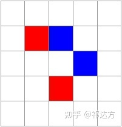
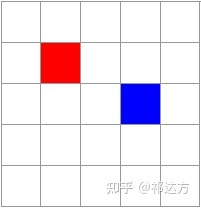
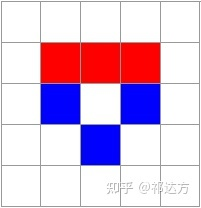
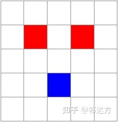

# 红蓝棋战争守则

> 红蓝棋主体规则由[祁达方](https://www.zhihu.com/people/qi-da-fang)制定，地形部分和多人混战部分由本项目作者悠悠补充。
> The rule's athuor is qidafang,but its extand rule is write by me.

> 感谢github的cliffigor前辈对本项目提供的分支修改！改的超规范！
> 
> Thanks for cliffigor's help.
##  军队调遣规则
>The rule used English will update someday.

红先蓝后，交替走棋，将其走到与之邻接的空白格子（所谓邻接就是上下左右最近一格，所谓空白就是没有双方棋子和不可通过的地形）。

## 军队战斗规则

如果一个棋子的邻接格子中，有两个或更多敌方棋子，则这个棋子将被歼灭。对棋盘上**所有棋子**进行判断后，将被歼灭的棋子一起拿掉。

如上图，轮到红方走棋。红方将下方红子上移一格，则形成对蓝子的夹击，该蓝子将被歼灭。与此同时，刚走动的红子本身，也处于被夹击的位置，自身也被歼灭。事实上形成了兑子，兑子后的局面如下：

兑子并非总是等价交换，对规则善加利用，则能打出一换二的效果：

如上图，轮到红方走棋，红方将中间的棋子向下走一格，这个冲锋陷阵的棋子当然会壮烈，但与此同时蓝方的左边棋子、右边棋子都处在了夹击之下，于是这三个棋子被同时拿掉，红方一换二有利。

## 地形规则

地图中有时会出现特殊标识的格子。高山地形不可通过。

初始地图大小不是固定的。当有棋子到达已知地图边界时，地图会向外扩展，地图的最外围是一圈高山地形。

地图的极限大小一般是一个长方形。

## 战争胜负规则

吃光对方棋子者获胜。